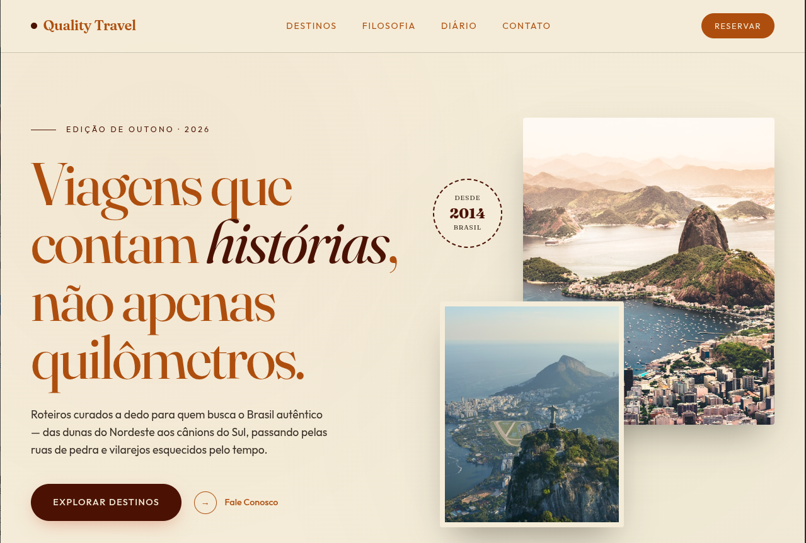

# ✈️ QualityTravel - Turismo Familiar

A **QualityTravel** é uma plataforma de agência de viagens focada em proporcionar experiências inesquecíveis para famílias. O projeto destaca destinos paradisíacos brasileiros, como Jericoacoara, Chapada Diamantina e a Serra Gaúcha, unindo um design moderno com uma navegação fluida.

<p align="center">
  
</p>

## 🌟 Diferenciais do Projeto

- **Foco no Público Familiar:** Curadoria de destinos e interface pensada para facilitar o planejamento em grupo.
- **Design Moderno:** Uso de elementos visuais de alta qualidade, tipografia elegante e layout responsivo.
- **Experiência do Usuário (UX):** Navegação intuitiva entre os destinos e pacotes disponíveis.
- **Responsividade Total:** Adaptado para uma visualização perfeita em computadores, tablets e smartphones.

## 🛠️ Tecnologias Utilizadas

Para este projeto, foram aplicadas tecnologias fundamentais de front-end:

- **HTML5:** Estrutura semântica para melhor SEO e acessibilidade.
- **CSS3:** Estilização personalizada, utilizando Flexbox e Grid para o layout.
- **JavaScript:** (Se houver) Interatividade para menus e filtros de destino.
- **Google Fonts:** Fontes selecionadas para transmitir confiança e conforto.

## 📍 Destinos em Destaque

O portal apresenta informações detalhadas sobre:
* 🌵 **Jericoacoara (CE):** Dunas e relaxamento à beira-mar.
* ⛰️ **Chapada Diamantina (BA):** Aventura e natureza para todas as idades.
* 🍷 **Serra Gaúcha (RS):** Conforto, gastronomia e paisagens europeias.

## 🚀 Como Visualizar

O projeto está disponível via GitHub Pages. Você pode acessá-lo diretamente através do link abaixo:

👉 [**Visualizar QualityTravel Online**](https://vanessenceweb.github.io/qualitytravel/)

## 📂 Como clonar o repositório

Se desejar contribuir ou estudar o código localmente:

1. Clone o repositório:
   ```bash
   git clone [https://github.com/VANESSENCEWEB/qualitytravel.git](https://github.com/VANESSENCEWEB/qualitytravel.git)
